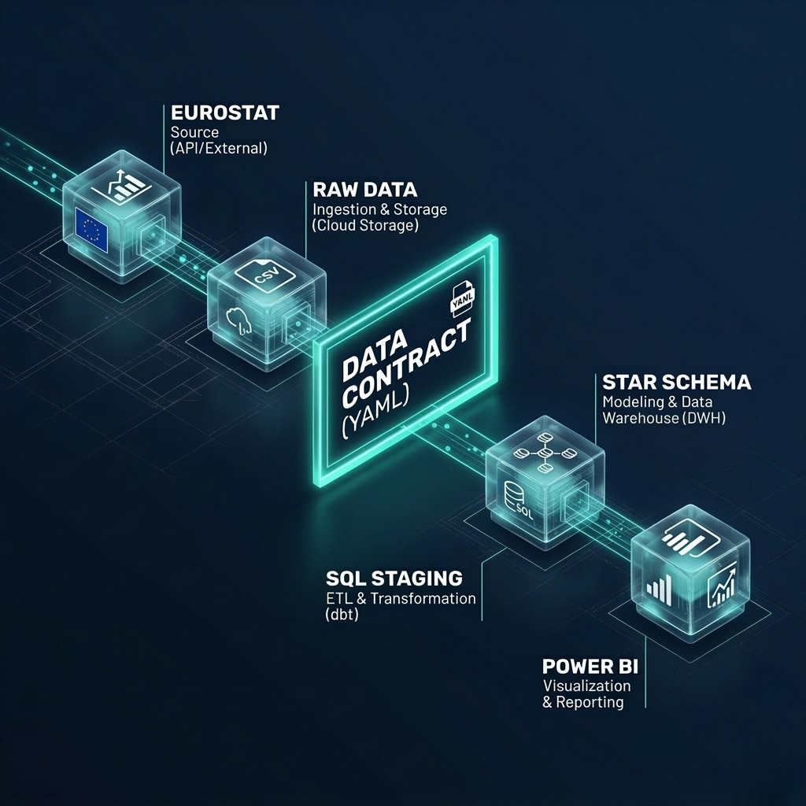

# Contract First

[](https://opensource.org/licenses/MIT)
[](https://github.com/MichalMrugala/contract-first-warehouse/releases)
[](docs/article-10-mapping.md)
[](https://architecture-first.beehiiv.com)

> **The reference implementation for EU AI Act Article 10 data governance.**
> A governed star schema data warehouse built from 39.5M rows of EU energy data in 8 weekends. YAML data contracts written before a single SQL query.



A public build-in-public project by [Michał Mrugała](https://www.linkedin.com/in/michal-mrugala02/) — law student at WSB Merito Wrocław, data engineering intern at ArcelorMittal, and creator of the [Architecture First](https://architecture-first.beehiiv.com) newsletter.

---

## Why this exists

EU AI Act Article 10 enforcement begins **August 2, 2026**. Penalties: **€20M or 4% of global turnover**.

Article 10 requires documented data governance for every high-risk AI system: documented bias assessment, documented data gaps, documented provenance, documented legal basis. Most data teams have none of these in a regulator-defensible format.

This repository is the working reference for what compliance looks like when it lives in code, not in PDFs.

---

## What you will find here

- **Working YAML data contracts** mapped to all 8 Article 10 sub-clauses ([see mapping](docs/article-10-mapping.md))
- **A 39.5M row data warehouse** built from real Eurostat data with 24 automated quality tests
- **A complete Power BI implementation** with 9 DAX measures across 7 pages — not 50
- **Every architecture decision documented** with the reasoning behind it
- **Eight weekly write-ups** showing what broke, what was fixed, and what the principle was

---

## Quick stats

| Metric | Value |
|---|---|
| Source rows ingested | 39,486,867 |
| Fact table rows | 20,709,414 |
| Dimensions | 6 (with 0 orphan keys) |
| Quality tests | 24 (all passing) |
| DAX measures | 9 (across 7 Power BI pages) |
| Weekends to build | 8 |
| Public from day | 1 |

---

## The Philosophy

**SQL First. Model Second. DAX Last.**

Problems solved in SQL stay solved. Problems deferred to Power BI multiply.

---

## The Stack

- **Database:** DuckDB v1.5.0 (local, serverless, columnar)
- **Data Source:** Eurostat `nrg_bal_c` — Complete Energy Balances (EU-27, 1990–2024)
- **Contracts:** ODCS v3.1.0 (YAML) with custom `x_ai_act_article_10` extension
- **Visualization:** Power BI Desktop
- **Version Control:** Git + GitHub

---

## EU AI Act Article 10 Compliance

Each of the 8 Article 10 sub-clauses maps to specific YAML fields in the data contract. The contract is validated on every pipeline run via SQL tests — not signed off once and forgotten.

**Read the full mapping:** [`docs/article-10-mapping.md`](docs/article-10-mapping.md)

The mapping covers:
- Sub-clause 2(a) — Data governance practices
- Sub-clause 2(b) — Data collection procedures
- Sub-clause 2(c) — Data preparation operations
- Sub-clause 2(d) — Bias examination
- Sub-clause 2(e) — Data gaps identification
- Sub-clause 2(f) — Relevance assessment
- Sub-clause 3 — Representativeness
- Sub-clause 5 — Special categories handling

---

## 8-Week Build Log

| Week | Layer | Status | Read |
|---|---|---|---|
| 1 | Contract + Raw + Exploration | ✅ | [Quality Report](docs/quality-report-week1.md) |
| 2 | Quality Gates + 3-tier Staging | ✅ | [Quality Report](docs/quality-report-week2.md) |
| 3 | Star Schema (6 dims + fact) | ✅ | [Schema docs](docs/quality-report-week2.md) |
| 4 | Power BI Connection + DAX | ✅ | [DAX catalog below](#dax-measure-catalog) |
| 5 | DAX Refinement + KPI Logic | ✅ | Renewable share fix, CAGR, balance filters |
| 6 | Final Dashboard (7 pages) | ✅ | Executive Pulse, Geographic, Energy Mix, Balance Flow, Transition Story, Country Profile, Product Detail |
| 7 | Governance Layer (YAML v0.4) | ✅ | Article 10 + GDPR Art 30 + lineage |
| 8 | Documentation + Release | ✅ | [v1.0.0 shipped](https://github.com/MichalMrugala/contract-first-warehouse/releases/tag/v1.0.0) |

---

## Key Findings

- **46% of source data is structurally missing** (Eurostat flag `m`). Treating NULLs as zeros overestimates totals by 88%.
- **Germany renewable energy** grew **10.8x** from 1990 to 2024 (285,924 TJ → 3,100,935 TJ).
- **Norway leads** total energy production across the EU-27 dataset.
- **9 DAX measures replaced an estimated 40+** that a flat data model would require. Star schema did the work.

---

## DAX Measure Catalog

| Measure | DAX Pattern | Purpose |
|---|---|---|
| Total Energy | `SUM(obs_value)` | Base aggregation |
| YoY Change % | `CALCULATE + FILTER(ALL)` | Year-over-year comparison |
| CAGR | `POWER(DIVIDE, 1/N) - 1` | Compound annual growth rate |
| Share of Total % | `DIVIDE + ALL(Dim_EnergyProduct)` | Product share of total |
| Moving Avg 3Y | `AVERAGEX + FILTER(ALL)` | 3-year smoothing |
| Latest Energy | `CALCULATE + MAX(year)` | Dynamic KPI for slicer |
| Latest YoY | `CALCULATE + MAX(year)` | Dynamic YoY KPI |
| Latest Renewable Share | `CALCULATE + MAX(year) + filter` | Dynamic renewables KPI |
| Latest Germany Renewables | `CALCULATE + MAX(year) + filters` | Country-specific KPI |

---

## Project Structure
contract-first-warehouse/
├── README.md
├── LICENSE
├── CITATION.cff
├── CHANGELOG.md
├── CONTRIBUTING.md
├── CODE_OF_CONDUCT.md
├── .gitignore
├── /raw                          # Source data (gitignored)
│   └── nrg_bal_c.csv
├── /contracts
│   └── energy_balance_raw.yaml   # Data contract v0.4 + Article 10 + GDPR Art 30
├── /sql
│   ├── /explore                  # 17 exploration queries
│   ├── /quality                  # 24 automated tests
│   ├── /staging                  # 3-tier staging (clean/missing/rejected)
│   └── /model                    # 6 dimension tables + fact table
├── /export/parquet               # Star schema for Power BI consumption
├── /powerbi
│   ├── /themes                   # Custom teal theme (eu_energy_architecture.json)
│   └── contract_first.pbix       # Power BI report (binary, gitignored)
└── /docs
├── article-10-mapping.md     # The reference EU AI Act Article 10 mapping
├── quality-report-week1.md
├── quality-report-week2.md
└── architecture-sketch.png
---

## Quick Start (5 minutes)

```bash
# 1. Clone
git clone https://github.com/MichalMrugala/contract-first-warehouse.git
cd contract-first-warehouse

# 2. Download Eurostat data (SDMX-CSV format)
# https://ec.europa.eu/eurostat/databrowser/view/nrg_bal_c/default/table?lang=en
# Place in: raw/nrg_bal_c.csv

# 3. Build the warehouse (DuckDB v1.5.0+ required)
duckdb warehouse.duckdb
.read sql/explore/01_exploration.sql
.read sql/quality/02_quality_checks.sql
.read sql/staging/06_staging_v2.sql
.read sql/model/07_dim_country.sql
# ... etc through 13_fact_energy_balance.sql

# 4. Export to Parquet for Power BI
COPY Fact_EnergyBalance TO 'export/parquet/fact_energy_balance.parquet'
  (FORMAT PARQUET, COMPRESSION ZSTD, ROW_GROUP_SIZE 100000);

# 5. Open the Power BI file
# powerbi/contract_first.pbix
```

---

## Who is this for?

You will get the most out of this repository if you are:

- **A data engineering lead** preparing your team for EU AI Act compliance
- **A privacy or compliance officer** who needs technical artifacts, not policy PDFs
- **A consultant** building governance practices for SME clients
- **A senior analyst** transitioning into data engineering and learning what "good" looks like
- **A student** learning data contracts the way they should be taught

---

## What I learned

Eight weekends. 39.5 million rows. The biggest finding was not technical.

Data quality and data governance are the same problem viewed from different angles. Quality engineers ask "is this row correct?" Governance officers ask "could you prove that to a regulator in court?" The YAML data contract answers both questions with the same artifact.

If your data contract cannot serve as legal evidence, it is documentation. If it can, it is governance.

---

## Follow the build

- **Newsletter:** [Architecture First](https://architecture-first.beehiiv.com) — one architecture rule every Friday at 8:00 CET
- **LinkedIn:** [Michał Mrugała](https://www.linkedin.com/in/michal-mrugala02/) — weekly posts on the build, the breaks, and the principle behind each fix

---

## Star this repository

If this repository saved you research time on Article 10 implementation — please star it. It helps other data engineers find this work before August 2, 2026.

---

## How to cite

See [`CITATION.cff`](CITATION.cff) for formal citation, or use:

> Mrugała, M. (2026). *Contract First: A reference implementation for EU AI Act Article 10 data governance*. GitHub. https://github.com/MichalMrugala/contract-first-warehouse

---

## License

- **Code:** MIT — see [LICENSE](LICENSE)
- **Data:** Eurostat open data license (CC BY 4.0)
- **Documentation:** CC BY 4.0
